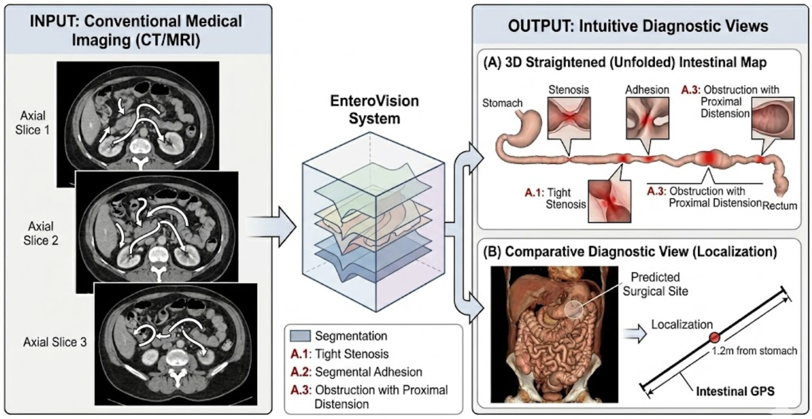
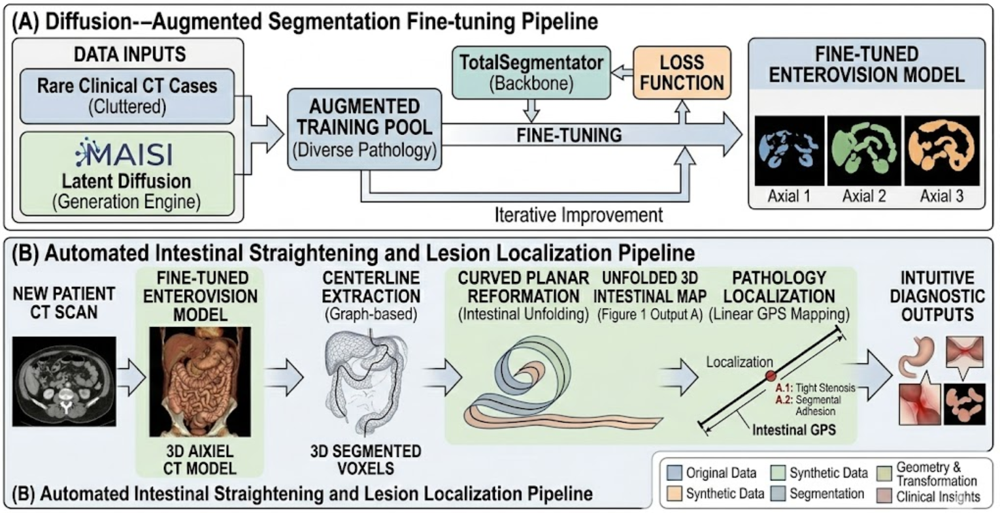

# EnteroVision: CT 기반 장 전개를 통한 가상 내시경

**한국어 | [English](README.md)**

> **논문명:** *EnteroVision: Virtual Endoscopy via CT-based Intestinal Straightening*
>
> 장협착증, 장유착 및 장폐쇄의 조기 진단을 위한 CT 기반 3D 분할 및 자동 장 전개(Curved Planar Reformation) 딥러닝 프레임워크

---

## 개요



*그림 1 — EnteroVision 개념도: (좌) 기존 CT에서 복잡하게 얽힌 장 구조. (중) AI 엔진의 분할 및 전개 처리. (우) 출력: 3D 일자 전개 장 지도 및 수술 위치 정밀 좌표 뷰.*

---



*그림 2 — 전체 파이프라인: (A) MAISI 기반 데이터 부족 해결을 위한 Diffusion 증강 파인튜닝. (B) TotalSegmentator + 중심선 추출 + CPR 자동 추론 파이프라인.*

---

## 연구 배경 및 동기

장협착증·장유착·장폐쇄 진단에는 현재 대장내시경이 필수적이지만, 이는 환자에게 불편하고 침습적인 검사입니다. 복부 CT는 보조 도구로 활용되지만:

- 뒤엉킨 3D 장 구조에서 병변 위치를 정확히 파악하기 어려움
- CT 영상만으로 수술 위치를 특정하기가 매우 어려움

**EnteroVision**은 CT를 주요 진단 도구로 활용하여 딥러닝으로 다음을 수행합니다:

1. 희귀 CT 데이터 생성 (MAISI Latent Diffusion)
2. 3D 장 구조 분할 (Fine-tuned TotalSegmentator)
3. 장을 일자로 전개하는 가상 내시경 뷰 생성 (CPR)
4. 거리 기반 좌표로 병변 및 수술 위치 Localization

---

## 코드 구조 분석

```
EnteroVision_v002/
├── app_small_bowel.py          # Streamlit 앱: 소장 분석
├── app_colon_analysis.py       # Streamlit 앱: CT 대장조영술 (CPR)
├── src/
│   ├── totalsegmentator_wrapper.py   # TotalSegmentator v2 통합 래퍼
│   ├── colon_cpr_visualizer.py       # Curved Planar Reformation 엔진
│   ├── volume_renderer.py            # 3D 볼륨 렌더링 (Plotly)
│   └── ui_logger.py                  # 실시간 UI 로깅
├── imgs/                       # 논문용 이미지
├── requirements.txt
└── datasets/                   # CT 데이터 (git 추적 제외)
    ├── ct_images/              # 입력 CT 스캔 (.nii.gz)
    └── ct_labels/              # TotalSegmentator 출력 (자동 생성)
```

### 모듈별 상세 설명

#### `src/totalsegmentator_wrapper.py`
- TotalSegmentator v2 CLI를 래핑하여 CT에서 104개 해부학 구조 분할
- 완전한 라벨 매핑 관리 (소장 = 48번, 대장 = 50번 등)
- Segmentation 파일에서 모든 존재하는 장기 자동 감지
- 중복 계산 방지를 위해 `datasets/ct_labels/`에 결과 캐싱

#### `src/colon_cpr_visualizer.py`
- **Curved Planar Reformation (CPR)** 전체 파이프라인 구현:
  1. 마스크 전처리 (노이즈 제거, 홀 채우기, 침식)
  2. 3D 스켈레톤화 → 중심선 추출
  3. 그래프 기반 최장 경로 정렬 (`networkx`)
  4. 스플라인 스무딩 (`splprep`/`splev`)
  5. 수직 단면에서 Trilinear 보간
- Plotly 기반 3D + 2D CPR 히트맵 출력

#### `src/volume_renderer.py`
- Marching Cubes 표면 재구성으로 3D 장기 렌더링
- 장기별 색상 및 투명도 제어
- CT 슬라이스 뷰어 (Axial/Sagittal/Coronal + 장기 오버레이)
- `create_straightened_view()`: 장기를 2D 선형 맵으로 투영

#### `app_small_bowel.py`
- 소장 분석 엔드-투-엔드 Streamlit UI
- 탭: 3D 시각화, 전체 장기 3D, CT 슬라이스, 전개 뷰, 분석 리포트
- 장기 시스템별 그룹 필터링 (소화기계, 비뇨기계, 호흡기계, 순환기계, 골격계)
- 사이드바 실시간 처리 로그

#### `app_colon_analysis.py`
- CT 대장조영술 전문 애플리케이션
- 탭: 3D 대장 뷰, CPR 분석, CT 슬라이스, 중심선 분석, 보고서
- 곡률 통계, HU 값 분석, 분석 보고서 다운로드

---

## 전체 파이프라인

```
CT 입력 (.nii.gz)
    │
    ▼
TotalSegmentator v2  ──[MAISI 희귀 병변 파인튜닝]──►  파인튜닝 모델
    │
    ▼
3D 분할 (소장, 대장, 외 102개 구조)
    │
    ▼
중심선 추출 (3D 스켈레톤화 → 그래프 기반 정렬 → 스플라인 스무딩)
    │
    ▼
CPR (Curved Planar Reformation) — 중심선 따라 Trilinear 보간
    │
    ▼
전개된 장 지도 + 병변 Localization (선형 거리 좌표)
```

---

## 설치

```bash
# Python 3.9+ 권장
pip install -r requirements.txt

# GPU 가속 (선택사항, 강력 권장)
pip install torch torchvision --index-url https://download.pytorch.org/whl/cu118
```

### 데이터 준비

CT 스캔을 다음 경로에 배치:
```
EnteroVision_v002/datasets/ct_images/<케이스명>_image.nii.gz
```

---

## 실행

```bash
# 소장 분석
streamlit run app_small_bowel.py --server.port 8501

# CT 대장조영술 (CPR)
streamlit run app_colon_analysis.py --server.port 8502
```

브라우저에서 `http://localhost:8501`, `http://localhost:8502`로 접속.

### 원격 서버 (SSH 터널링)
```bash
ssh -L 18501:localhost:8501 introai16@147.46.121.39
ssh -L 18502:localhost:8502 introai16@147.46.121.39
```
이후 `http://localhost:18501`, `http://localhost:18502`로 접속.

---

## 실험 관리

실험은 타임스탬프 기반 폴더로 `experiments/` 아래 관리됩니다:
```
experiments/
└── YYYYMMDD_HHMMSS_<실험명>/
    ├── config.yaml
    ├── logs/
    └── results/
```

---

## 기술 스택

| 구성요소 | 기술 |
|---|---|
| AI 분할 | TotalSegmentator v2 (104개 해부학 구조) |
| 데이터 증강 | MAISI (Latent Diffusion) |
| 장 전개 | CPR + 3D 스켈레톤화 |
| 3D 시각화 | Plotly + Marching Cubes |
| UI 프레임워크 | Streamlit |
| 영상 처리 | SimpleITK, scikit-image |
| 수치 연산 | NumPy, SciPy |

---

## 한계 및 주의사항

- **연구 목적 전용** — 임상 진단 용도 사용 금지
- TotalSegmentator의 소장 분할 정확도 제한; MAISI 파인튜닝으로 보완
- CPR 품질은 중심선 추출 품질에 의존
- TotalSegmentator 추론에 GPU 강력 권장

---

## 라이선스

연구 및 교육 목적. 상업적 사용 시 별도 문의 필요.
